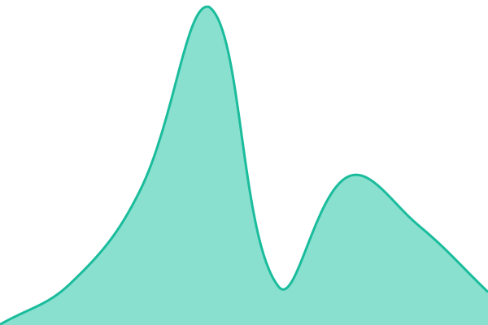
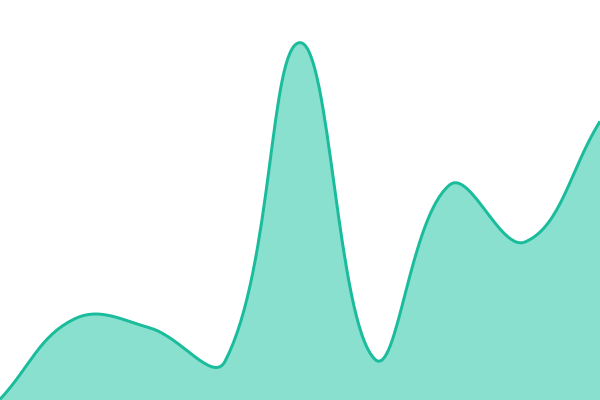
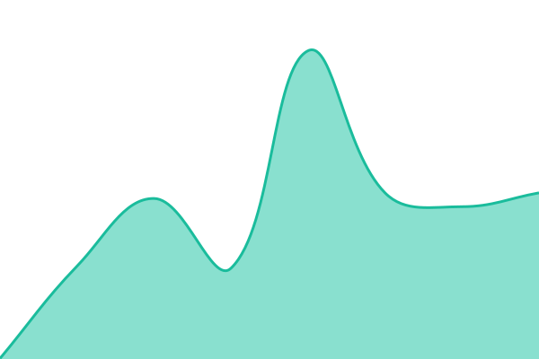

# [📈 Live Status](https://status.tusharkantnaik.com): <!--live status--> **🟧 Partial outage**

This repository contains the open-source uptime monitor and status page for [Tushar-Kant-Naik](https://status.tusharkantnaik.com), powered by [Upptime](https://github.com/upptime/upptime).

With [Upptime](https://upptime.js.org), you can get your own unlimited and free uptime monitor and status page, powered entirely by a GitHub repository. We use [Issues](https://github.com/Tushar-Kant-Naik/status/issues) as incident reports, [Actions](https://github.com/Tushar-Kant-Naik/status/actions) as uptime monitors, and [Pages](https://status.tusharkantnaik.com) for the status page.

<!--start: status pages-->
<!-- This summary is generated by Upptime (https://github.com/upptime/upptime) -->
<!-- Do not edit this manually, your changes will be overwritten -->
<!-- prettier-ignore -->
| URL | Status | History | Response Time | Uptime |
| --- | ------ | ------- | ------------- | ------ |
|  [Portfolio (tusharkantnaik.in)](https://tusharkantnaik.in) | 🟥 Down | [portfolio-tusharkantnaik-in.yml](https://github.com/Tushar-Kant-Naik/status/commits/HEAD/history/portfolio-tusharkantnaik-in.yml) | 

 167ms
     
 | 

<a href="https://status.tusharkantnaik.com/history/portfolio-tusharkantnaik-in">98.77%</a>
    

|  [Portfolio (.com)](https://tusharkantnaik.com) | 🟥 Down | [portfolio-com.yml](https://github.com/Tushar-Kant-Naik/status/commits/HEAD/history/portfolio-com.yml) | 

 197ms
     
 | 

<a href="https://status.tusharkantnaik.com/history/portfolio-com">98.77%</a>
    

|  [Design System — Storybook](https://design.tusharkantnaik.com) | 🟩 Up | [design-system-storybook.yml](https://github.com/Tushar-Kant-Naik/status/commits/HEAD/history/design-system-storybook.yml) | 

 343ms
     
 | 

<a href="https://status.tusharkantnaik.com/history/design-system-storybook">100.00%</a>
    

<!--end: status pages-->

[**Visit our status website →**](https://status.tusharkantnaik.com)

## 📄 License

- Powered by: [Upptime](https://github.com/upptime/upptime)
- Code: [MIT](./LICENSE) © [Anand Chowdhary](https://anandchowdhary.com)
- Data in the `./history` directory: [Open Database License](https://opendatacommons.org/licenses/odbl/1-0/)
